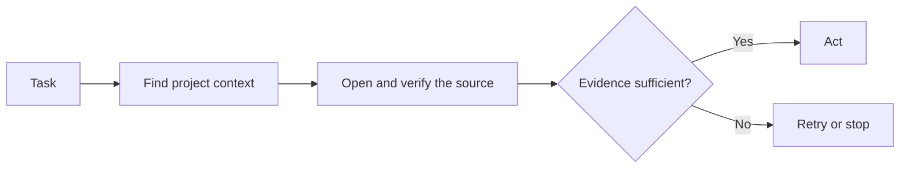

# Atlas

Atlas helps coding agents find the information they need before they act.

A coding agent can write code that works but is wrong for the repository. The
problem often lies in a wider project context: a dependency in another module,
a previous decision, an outdated document, or conflicting sources.

Atlas puts that context before action:



The repository remains the source of truth. Atlas keeps the relevant context
accessible so the agent can verify it before making a change.

## Atlas Repository vs. Instances

The Atlas Git repository is the package you download to install and update
Atlas.

Installing Atlas in a project creates an Atlas instance. Each instance belongs
to the project where it is installed and remains separate from all other
instances.

Use the same Atlas Git repository to install or update multiple separate
instances.

## Install Atlas

The instructions below assume:

```text
/path/to/atlas                  Atlas Git repository
/path/to/your-repository        project where the Atlas instance will be installed
```

1. Enter the Atlas Git repository:

   ```bash
   cd /path/to/atlas
   ```

2. Install an Atlas instance in the project:

   ```bash
   scripts/atlas-init --repo /path/to/your-repository
   ```

3. Enter the project repository:

   ```bash
   cd /path/to/your-repository
   ```

4. Run Atlas from the installed instance:

   ```bash
   .atlas/bin/atlas verify
   ```

The Atlas instance stores its configuration, runtime, index, and rebuildable
state under the `.atlas/` folder in the installed project repository.

By default, installation adds a marked block to `AGENTS.md` that instructs
coding agents to retrieve and verify project context before acting. Existing
instructions remain unchanged. Use `--no-agent-instructions` to skip the
block.

## Evidence Before Acting

Evidence is the deterministic handoff from retrieval to source verification.
It tells the agent whether to continue, retry, or stop.

Example query:

```bash
.atlas/bin/atlas evidence "where is authentication handled?"
```

Atlas returns the relevant sources, where they are, why they matched, and
whether they are current enough to trust.

```json
{
  "state": "strong",
  "evidence": [
    {
      "state": "strong",
      "label": "Authentication Architecture",
      "source": {
        "status": "available",
        "path": "docs/AUTHENTICATION.md"
      },
      "freshness": {
        "state": "current",
        "basis": "content-digest-comparison"
      },
      "match": {
        "reasons": ["lexical-token-match", "vector-similarity"]
      }
    }
  ]
}
```

The agent opens the cited source and verifies the relevant passage against the
current state of the repository before answering or making a change.

### Evidence States

Each result has one of five states:

| State | Meaning | Agent action |
| --- | --- | --- |
| `strong` | The source is current and matches the task | Open and verify it, then continue |
| `weak` | The match is not strong enough to support the decision | Narrow the request or inspect more sources |
| `stale` | The source changed after the evidence was built | Refresh the evidence and verify the current source |
| `missing` | Atlas found no usable source within the source policy | Check the policy or ask for context; do not invent it |
| `conflicting` | Relevant sources disagree | Stop and resolve the conflict before continuing |

Atlas assigns the evidence state from the source policy, source availability,
freshness, and match strength. No component can override that result by
returning a higher state label. A higher state requires new evidence or a valid
refresh.

## Choose What Atlas May Read

A new Atlas instance reads `AGENTS.md`, `README.md`, `docs`, and `memory`
folders by default.

To include source code or use different paths, define them during installation:

```bash
cd /path/to/atlas
scripts/atlas-init \
  --repo /path/to/your-repository \
  --include README.md \
  --include docs \
  --include src \
  --extension .js
```

When you use `--include`, the listed paths replace the default set. Atlas does
not read anything outside the configured source policy.

After installation, you can change the policy in
`.atlas/atlas.instance.json`.

## Optional Graph Visualisation

A graph provides a visual map of the project. Evidence works without it.

Install Graph in the project:

```bash
cd /path/to/atlas
scripts/atlas-init \
  --repo /path/to/your-repository \
  --with-graph
```

Then ask Atlas to map the project from the sources available to the instance:

```bash
cd /path/to/your-repository
.atlas/bin/atlas map
```

Atlas prepares a cited mapping request and prints the next step if input from
the active coding agent is required.

Open Graph:

```bash
.atlas/bin/atlas graph --open
```

The result is a map of the project built from an accepted, source-cited system
model.

## Update or Remove Atlas

Update an existing instance from a newer Atlas Git repository:

```bash
cd /path/to/atlas
scripts/atlas-init \
  --repo /path/to/your-repository \
  --update
```

Remove an instance from the project repository:

```bash
cd /path/to/your-repository
.atlas/bin/atlas uninstall --dry-run
.atlas/bin/atlas uninstall
```

If the installed command is unavailable, use the matching Atlas Git
repository:

```bash
/path/to/atlas/scripts/atlas-uninstall \
  --repo /path/to/your-repository \
  --yes
```

See [`UNINSTALLATION.md`](core/product/docs/UNINSTALLATION.md) for the complete
ownership and recovery rules.

## Further Reading

Start with [`WALKTHROUGH.md`](core/product/docs/WALKTHROUGH.md) for the complete
repository-local mental model. The remaining documents each own one narrower
question:

- **Evidence:**
  [`EVIDENCE_SOURCES_AND_MAPPING.md`](core/product/docs/EVIDENCE_SOURCES_AND_MAPPING.md)
  explains how sources become evidence and maps;
  [`EVIDENCE_V2.md`](core/product/docs/EVIDENCE_V2.md) freezes the packet; and
  [`AGENT_RAG_WORKFLOW.md`](core/product/docs/AGENT_RAG_WORKFLOW.md) defines the
  agent's response.
- **Installation:** [`INSTANCE.md`](core/product/docs/INSTANCE.md),
  [`INSTALLATION.md`](core/product/docs/INSTALLATION.md), and
  [`UNINSTALLATION.md`](core/product/docs/UNINSTALLATION.md) define ownership,
  runtime integrity, and safe removal.
- **System boundaries:** [`ARCHITECTURE.md`](core/product/docs/ARCHITECTURE.md),
  [`TAXONOMY.md`](core/product/docs/TAXONOMY.md), and
  [`GENERATION_PROVIDERS.md`](core/product/docs/GENERATION_PROVIDERS.md) define
  components, vocabulary, retrieval, and generation.
- **Operation:** [`SYNC.md`](core/product/docs/SYNC.md) defines causal
  reconciliation, while
  [`KNOWN_LIMITATIONS.md`](core/product/docs/KNOWN_LIMITATIONS.md) records
  current product limits.
- **Provenance:**
  [`RESEARCH_FOUNDATIONS.md`](core/product/docs/RESEARCH_FOUNDATIONS.md) records
  product origin, later research influences, and non-claims.

## License, warranty, and liability

Copyright 2026 Ivan Draven and Olena Zhyvkova-Draven

Licensed under the Apache License, Version 2.0 (the "License"); you may not use
this software except in compliance with the License. You may obtain a copy of
the License at:

<https://www.apache.org/licenses/LICENSE-2.0>

Unless required by applicable law or agreed to in writing, software distributed
under the License is distributed on an "AS IS" BASIS, WITHOUT WARRANTIES OR
CONDITIONS OF ANY KIND, either express or implied. See the License for the
specific language governing permissions and limitations under the License.

In practical terms, you are responsible for determining whether Atlas is
appropriate for your use and for the risks arising from that use. To the
maximum extent permitted by applicable law, the licensors and contributors are
not liable for damages arising from use of, or inability to use, Atlas, as
described in Sections 7 and 8 of the Apache License 2.0. This summary does not
modify or replace the terms in `LICENSE`.
