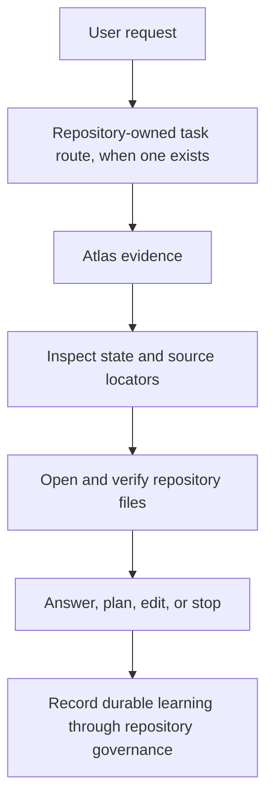

# Atlas Agent RAG Workflow

Status: active

## Purpose

This document defines the evidence-before-action obligations for an agent using
an installed Atlas Instance. Atlas narrows the repository source surface. The
agent opens and verifies the cited files, exercises judgment, and performs the
requested work.



The consumer repository owns source truth, inclusion policy, durable knowledge,
and task routing. Atlas owns retrieval and a rebuildable local index. The agent
owns interpretation and action.

## Normative Agent Loop

### 1. Preserve The User's Request

Use the original request as the first evidence query unless a consumer-owned
task route requires a clearly named narrower derivation. Do not begin with an
unbounded repository scan when Atlas can first identify likely sources.

### 2. Invoke The Repository-Local Instance

From the consumer repository:

```bash
.atlas/bin/atlas evidence "user request"
```

Routine queries ensure the rebuildable index automatically. Use the diagnostic
surfaces only when needed:

```bash
.atlas/bin/atlas search "narrowed query"
.atlas/bin/atlas index
```

`evidence` is the normal agent-facing surface. `search` explains ranking;
`index` is for explicit setup or diagnosis. The complete source, index,
freshness, and packet mechanics are canonical in
[`EVIDENCE_SOURCES_AND_MAPPING.md`](EVIDENCE_SOURCES_AND_MAPPING.md) and
[`EVIDENCE_V2.md`](EVIDENCE_V2.md).

### 3. Respond To The Evidence State

Retrieval success and evidence trust are separate. The agent must follow the
packet state:

| State | Required response |
| --- | --- |
| `strong` | Open and verify the highest-ranking relevant cited source before acting |
| `weak` | Narrow or rephrase the query, inspect diagnostic search, and gather more evidence |
| `stale` | Refresh or correct the source derivation, then retrieve and verify again |
| `missing` | Inspect the source policy or request the missing durable context; do not invent it |
| `conflicting` | Stop the affected conclusion until the consumer reconciles the conflict explicitly |

A high score, polished summary, or generated system model does not override
these states. An adapter may reduce trust but cannot promote an excluded,
missing, stale, unsupported, or weakly matched source to `strong`.

### 4. Open And Verify The Sources

Open the highest-ranking relative paths relevant to the task. Read enough
surrounding context to understand the cited passage, then compare it with
current code, tests, configuration, and repository state where the task
requires that comparison.

Treat labels, summaries, excerpts, and scores as navigation aids. They do not
replace the original file. If documentation and current implementation
disagree, do not silently choose the more convenient statement. Follow the
repository's authority rules and surface the stale or conflicting record for
correction.

### 5. Answer, Plan, Edit, Or Stop

Act only after the relevant evidence has been verified. Atlas does not select a
code mutation, write the final answer, or turn retrieved prose into authority.

Keep uncertainty visible. When the available sources do not support the
affected conclusion, ask for context or stop that part of the task rather than
filling the gap with a plausible assumption.

### 6. Preserve Durable Learning

When work produces a durable decision, invariant, operating rule, or handoff,
write it through the consumer repository's normal documentation or memory
governance. Do not write directly to the SQLite index, generated summaries, or
Graph state.

```text
repository files    durable consumer knowledge
Atlas index         rebuildable retrieval acceleration
agent conversation  temporary working context
```

The next Evidence command notices changed admitted files and refreshes derived
state. Guidance for writing useful repository evidence is in
[`EVIDENCE_SOURCES_AND_MAPPING.md`](EVIDENCE_SOURCES_AND_MAPPING.md).

## How The Agent Knows To Invoke Atlas

Fresh initialization can create or append a deterministic managed block in the
consumer's root `AGENTS.md`. For hosts that honor repository instructions, the
block requires the agent to:

1. follow the consumer-owned task route first;
2. query `.atlas/bin/atlas evidence` before broad source exploration;
3. inspect the state and open relevant relative source locators;
4. use diagnostic search after weak, stale, or missing evidence;
5. stop affected conclusions on conflicting evidence; and
6. leave source-policy changes, durable writes, sync publication, and remote
   service decisions to the consumer.

Inspect the installed instruction without changing it:

```bash
.atlas/bin/atlas agent-instructions
```

Install or repair only the marked Atlas region explicitly:

```bash
.atlas/bin/atlas agent-instructions --install
```

Everything outside the markers remains consumer-owned. Initialization may opt
out with `--no-agent-instructions`; Product update does not rewrite the tracked
instruction unless the consumer requests `--refresh-agent-instructions`.

Hosts that do not honor root `AGENTS.md` need a replaceable skill, plugin, MCP,
or wrapper that calls the same installed CLI and preserves these obligations.

## Bounded Fallback

If repeated Evidence queries remain weak, stale, or missing:

1. inspect `.atlas/atlas.instance.json` for the intended admitted paths;
2. use `atlas search` to inspect ranking and matched terms;
3. verify or explicitly rebuild the local index;
4. perform only the smallest direct source search needed to locate the missing
   durable record; and
5. return to source verification before acting.

Fallback does not authorize an unrestricted scan or turn uncited generated
context into repository truth.

## Related Boundaries

- [`EVIDENCE_SOURCES_AND_MAPPING.md`](EVIDENCE_SOURCES_AND_MAPPING.md) explains
  how evidence sources, indexing, freshness, strong results, and `atlas map`
  work.
- [`INSTANCE.md`](INSTANCE.md) defines repository-local setup, source policy,
  custom adapters, and the optional Graph projection.
- [`GENERATION_PROVIDERS.md`](GENERATION_PROVIDERS.md) defines source-bounded
  generation handshakes; generation never replaces this evidence-first loop.
- [`SYNC.md`](SYNC.md) defines causal multi-machine reconciliation.
- [`ARCHITECTURE.md`](ARCHITECTURE.md) defines Atlas Product and Graph
  boundaries.

The invariant is simple: retrieve repository evidence, verify the original
source, and stop when the repository does not support the conclusion.
