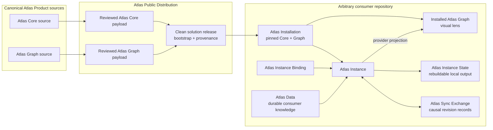
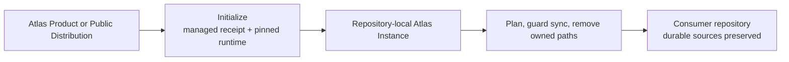
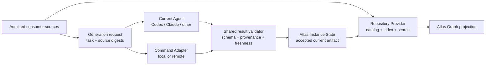
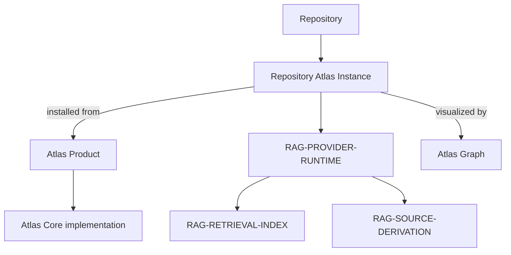

# Atlas Product Architecture

Status: active

Atlas Product is the source-neutral solution. Atlas Core supplies retrieval,
provider, installation, instance, sync, and command contracts. Atlas Graph is
the sibling visual lens. Neither product component owns consumer memory.

Atlas's raw product direction predates its research review. The later
proof-of-concept literature shaped vocabulary, boundaries, and validation
without becoming an origin claim or a list of implemented algorithms.
`RESEARCH_FOUNDATIONS.md` records that provenance and the exact non-claims.

## Product And Consumer Boundaries

The Public Distribution contains reviewed payloads from both canonical product
sources. The provider-projection edge terminates at the Graph copy installed in
the consumer repository; a running Atlas Instance does not call back into a
product development checkout.

Product updates replace verified installation files. They do not move Atlas
Data or Atlas Instance State. Sync exchanges consumer-owned records; it does
not synchronize Atlas Product source.

The arbitrary consumer repository shown above is also the physical Atlas
Instance root. Its `.atlas/` directory is the control plane for manifests,
locks, installed runtime, commands, and configured local state. Durable Atlas
Data stays in declared consumer-owned source roots outside `.atlas/`, such as
`memory/` or `docs/`; `.atlas/` remains excluded from source indexing to avoid
self-indexing control and generated material.

The agent-facing loop precedes visualization: the agent queries the local
instance, Atlas ensures its index matches current source digests, the agent
opens and verifies the returned source paths, and only then answers or changes
the repository. `AGENT_RAG_WORKFLOW.md` defines that loop. Atlas Graph is an
optional consumer of the same provider-owned knowledge after retrieval.

## Atlas Core

Atlas Core has eight source-neutral responsibilities:

1. install and verify the deterministic repository agent-instruction block for
   AGENTS-compatible hosts without overriding consumer task routes;
2. validate installation and instance manifests;
3. bind a consumer catalog and local index through the repository-provider
   contract;
4. index and search consumer catalogs, then return deterministic Evidence v2
   packets whose source reads remain bounded by the instance inclusion policy;
5. create and reconcile immutable causal sync revisions without choosing a
   divergent winner;
6. launch the installed Atlas Graph against a consumer-owned provider command
   or URL.
7. create and validate source-bounded generation requests so the current agent
   or a command adapter can write derived artifacts without acquiring durable
   repository authority.
8. plan and execute repository-local uninstallation while preserving consumer
   data, external exchanges, and bytes outside marker-owned integrations.

Consumer adapters, task routes, source inclusion policy, durable memory,
provider implementations, local indexes, and reconciliation decisions stay in
the Atlas Instance.

The lifecycle edge is reversible only for Atlas-owned material:

`UNINSTALLATION.md` defines the exact removal and refusal contract. Uninstall
does not reverse consumer-authored work performed while Atlas was installed.

Evidence v2 is the handoff from retrieval to an agent. Provider ranking keeps
lexical/vector diagnostics; the evidence projection adds safe relative source
paths, bounded line locators and excerpts, current source digests, adapter
identity, explicit score reasons, and strong/weak/stale/missing/conflicting
states. It omits absolute repository/index paths. A comparable adapter digest
is checked against current source bytes; a non-comparable mature-provider
digest remains labeled provider-asserted rather than content-verified.

The agent-invocation contract is the discovery layer above that handoff. It
creates one managed block in the consumer's root `AGENTS.md`, calls only the
relative installed CLI, and makes the query, evidence state, source locators,
and packet digest inspectable. Consumer-authored instructions outside the
markers, task routing, durable writeback, and host-specific packaging remain
outside Atlas Core authority.

## Retrieval And Generation Boundary

The current agent is the default because it reuses the user's active coding
relationship without requiring Atlas to own API credentials. It is a
request/result/apply handshake, not a process that Atlas can discover and
invoke. Command adapters receive the same request on stdin and return the same
result on stdout. `GENERATION_PROVIDERS.md` defines this boundary and the
supported adapter contract.

## Version Layers And Evidence Freeze

Atlas Core and Atlas Graph are independently shipped Git components. Evidence
v2 is a protocol implemented and released by Atlas Core, while an Atlas
Installation records the exact Core, Graph, and Evidence digests it received.
The generated Public Distribution has its own solution version and records all
component/protocol provenance without redefining it.

Evidence has no independent Git boundary because it has no independent
installation, package, implementation authority, or rollback surface. Its
normative specification is `EVIDENCE_V2.md`; `evidence-release.json` binds that
specification SHA-256 and compatibility to Atlas Core `0.3.0`. A separate
Evidence component or repository requires one of the explicit implementation,
package, release-cadence, or direct-negotiation triggers in `VERSIONING.md`.

## Architecture Room Traversal

Architecture traversal preserves the boundary between the reusable product and
one repository-owned installation. Room identifiers belong to the provider;
Atlas does not impose identifiers from another repository.

Each repository may expose its own `<Repository Name> Atlas Instance` room and
provider drilldowns. It reuses Product and Graph contracts without importing
another repository's room names, memory, or routes.

## Evidence Sources And Repository Mapping

Atlas keeps repository evidence separate from repository semantics. Admitted
files become digest-bearing, searchable source evidence and remain
non-navigable. Observed imports and links remain structural evidence rather
than inferred architecture. Core preserves those source records beside a
consumer adapter's richer semantic catalog instead of allowing summaries to
erase their paths, digests, excerpts, or locators.

Before `.atlas/bin/atlas map`, Graph can present only a truthful Source
Inventory. A fresh, validated `repository-system-model.v1` may add cited
responsibility-level components, relationships, flows, and unknowns. Only its
current semantic components become enterable rooms; raw files remain separate
retrieval evidence.

The repository authority remains the non-enterable overview anchor. When it is
projected inside a semantic room, its navigation returns to the repository
overview rather than requesting an authority room. This keeps repository
identity distinct from semantic-room identity in every installed repository.

[`EVIDENCE_SOURCES_AND_MAPPING.md`](EVIDENCE_SOURCES_AND_MAPPING.md) explains
source admission, scanning, indexing, Evidence v2 source verification,
custom-catalog composition, mapping request bounds, citations, freshness, and
Source Inventory behavior. [`GENERATION_PROVIDERS.md`](GENERATION_PROVIDERS.md)
owns the exact mapping handshake, system-model schema, and validation rules.

## Public Distribution Boundary

Atlas Public Distribution is the installable solution: reviewed Atlas Core and
Atlas Graph payloads, repository bootstrap commands, licenses, notices, and
component provenance. It has its own solution version while retaining the
versions and digests of the components and Evidence contract it contains.

The distribution is not a second implementation authority. Product changes
enter it through reviewed component releases, and installed instances use only
the pinned files recorded in their installation manifests and locks. A consumer
repository never needs a product-development checkout to retrieve evidence,
map the repository, open Graph, synchronize records, verify the installation,
or uninstall Atlas.

See [`TAXONOMY.md`](TAXONOMY.md) for canonical names,
[`VERSIONING.md`](VERSIONING.md) for version and compatibility layers, and
[`RESEARCH_FOUNDATIONS.md`](RESEARCH_FOUNDATIONS.md) for product and research
provenance.
