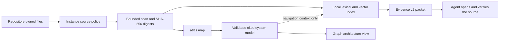
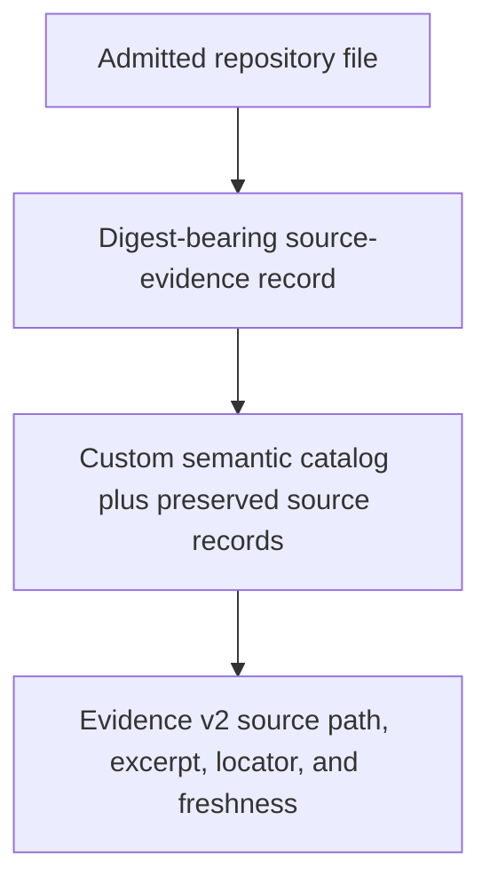

# How Atlas Evidence Is Built

This document explains how repository files become Evidence v2 and how the
separate mapping path turns cited sources into a system model. Exact packet
fields remain normative in `EVIDENCE_V2.md`; instance configuration remains
normative in `INSTANCE.md`; generation-provider execution remains normative in
`GENERATION_PROVIDERS.md`.

Atlas has two related jobs that must not be confused:

- Evidence finds repository files that may support the agent's next decision.
- Mapping builds a cited system model that Graph can visualize as architecture.

Evidence works directly from repository sources. It does not require a system
model. Mapping uses those sources to make higher-level claims about components,
responsibilities, boundaries, relationships, flows, and unknowns.



The cited repository file remains authoritative in both paths. A generated
summary or system model can help the agent navigate, but cannot replace the
source it cites.

## Where Evidence Sources Come From

Atlas does not create project truth. People and agents create durable project
knowledge through the repository's ordinary workflow. Atlas discovers only the
files admitted by the repository-owned instance policy.

A new instance admits these paths by default:

```text
AGENTS.md
README.md
docs/
memory/
```

The default file formats are `.json`, `.md`, `.toml`, `.txt`, `.yaml`, and
`.yml`. The default scan stops at six directory levels, 512 files, and 128 KiB
per file. It never follows symbolic links. Git data, Atlas runtime and state,
common dependency/build directories, archives, and configured exclusions stay
outside the scan.

The exact policy is tracked in `.atlas/atlas.instance.json`:

```json
{
  "source": {
    "include": ["AGENTS.md", "README.md", "docs", "memory"],
    "exclude": [
      ".atlas",
      ".git",
      "archive",
      "build",
      "certificates",
      "dist",
      "node_modules",
      "target"
    ],
    "extensions": [".json", ".md", ".toml", ".txt", ".yaml", ".yml"],
    "maxDepth": 6,
    "maxFiles": 512,
    "maxFileBytes": 131072
  }
}
```

The validator adds Atlas's mandatory exclusions even if they are omitted from
the displayed example. The repository can narrow or extend this policy
deliberately. For example, a TypeScript project may admit source and tests:

```bash
cd /path/to/atlas
scripts/atlas-init \
  --repo /path/to/project \
  --include README.md \
  --include docs \
  --include src \
  --include test \
  --extension .ts
```

After installation, source-policy changes are made explicitly in the tracked
instance file. A product update cannot silently broaden what Atlas may read.

## Are Decision Files The Evidence?

Decision files are one useful source, not the definition of evidence.

This repository might record a durable decision as:

```text
memory/DECISIONS/2026-04-18-session-token-storage.md
```

Another repository may keep the same authority in:

```text
docs/architecture/session-storage.md
```

Both are ordinary admitted Markdown files. Neither path receives a hidden
authority bonus. A clear decision record often retrieves well because its
heading and opening statement use the same precise terms as the task.

## Documentation Method

Atlas does not require a particular documentation method. The public
distribution supplies retrieval machinery, not a mandatory record structure.
A repository can use its existing conventions, templates, review checklists,
lint rules, or optional authoring skills to improve the material Atlas reads.

That local authoring discipline can materially improve results:

| Repository practice | Practical effect in Atlas |
| --- | --- |
| Use a direct title and state the conclusion near the beginning | The bounded searchable summary contains the terms an agent is likely to query |
| Separate context, decision, consequences, and revisit conditions | The agent can distinguish the chosen rule from its background and limits |
| Record status, scope, and what the document supersedes | Conflicting or obsolete claims are easier for people and repository adapters to detect |
| Link the decision to current code, tests, or configuration | The agent has a verification path beyond the prose record |
| Update or retire handoff and current-state records | Operational evidence does not continue presenting an old task state as current |

Missing a particular documentation method does not remove an Atlas capability.
Atlas can still scan, digest, index, rank, cite, and recheck an admitted file.
The likely loss is evidence usefulness: vague titles match fewer precise
queries, conclusions buried late in a long file may fall outside the bounded
searchable summary, and an unchanged but abandoned handoff can remain
semantically obsolete.

This is also why Atlas does not interpret `strong` as “true,” “canonical,” or
“approved.” `strong` means that an admitted, available, current file matched
the query strongly enough under the Evidence v2 contract. Repository review
and authority rules still determine whether the statement itself should guide
the work.

Other practical evidence sources include:

- `AGENTS.md` for repository-owned agent instructions and task-entry rules;
- `README.md` for the project purpose and normal operating path;
- architecture, operations, security, and release documents under `docs/`;
- accepted decisions, handoffs, or maintained memory records under an admitted
  `memory/` path;
- manifests and configuration such as `package.json`, `Cargo.toml`, or a
  runtime `.toml` file when their formats and paths are admitted;
- source modules when the repository explicitly admits their directory and
  extension; and
- tests when the repository explicitly admits them and the test behavior is
  relevant to the query.

For example, a handoff may record the exact continuation point of unfinished
work:

```markdown
# Current Handoff: Session Storage Migration

Updated: 2026-04-18

The encrypted-database write path is implemented and its contract tests pass.
The rollout flag remains disabled.

Next action: enable the path in staging and verify that legacy browser tokens
are ignored.

Blocker: production key rotation must finish before rollout.
```

A maintained memory record may state the repository's current operating facts:

```markdown
# Current Authentication State

Updated: 2026-04-18

Session tokens persist only in the encrypted application database. Browser
storage contains display preferences but no session token. The migration is
complete in staging and pending production rollout.

Supersedes: `memory/CURRENT/2026-03-02-session-storage.md`
```

The handoff answers “where should the next person continue?” The maintained
record answers “what is currently true for this area?” Neither becomes
architecture authority merely by living under `memory/`. Both must be updated,
superseded, or retired through the repository's normal workflow. A content
digest can prove that a file has not changed since indexing; it cannot detect
that an untouched statement has become wrong in the real system.

File category alone never makes evidence strong. A current source module can be
strong evidence for implemented behavior. A precise architecture decision can
be strong evidence for intent. A generated navigation summary with no readable
source remains weak even when its wording sounds correct.

There is no separate Evidence authoring format or import step. In practice, new
durable knowledge enters Atlas like this:

1. A person or agent records the decision, invariant, operating rule, test, or
   implementation through the repository's normal review process.
2. The file lands under an admitted path and uses an admitted extension.
3. The next `atlas evidence`, `atlas search`, or explicit `atlas index` command
   scans the current files and notices the changed catalog digest.
4. Atlas rebuilds its disposable local index and stores the file's current
   source digest in its source-evidence record.
5. A matching query can now return the relative path, current digest, bounded
   excerpt, line locator, score reasons, and evidence state.

If the file is outside the source policy, Atlas does not learn that it exists
and does not leak its path or contents. If the knowledge exists only in a chat,
an untracked note, or a generated summary without a source path, it is not
durable repository evidence.

## How One File Becomes Searchable Evidence

The default instance follows the same deterministic sequence for every
admitted file.

### 1. Atlas scans the admitted paths

The scan walks entries in stable sorted order. Before reading a file, it checks
the include roots, exclusions, depth, extension, file-count limit, byte limit,
file type, and every path segment for symbolic links.

For each accepted UTF-8 file Atlas records:

```json
{
  "path": "docs/architecture/session-storage.md",
  "bytes": 2841,
  "digest": "<SHA-256 of the complete UTF-8 file>",
  "title": "Store Session Tokens In The Encrypted Database"
}
```

For Markdown, the title is the first visible ATX heading. Headings inside HTML
comments or fenced examples are ignored. Other formats use the filename.

### 2. Atlas creates a source-evidence catalog record

The default adapter creates one non-navigable record for each scanned file:

```json
{
  "id": "source-<repository-and-path digest>",
  "label": "Store Session Tokens In The Encrypted Database",
  "metadata": {
    "entryKind": "source-evidence",
    "navigationKind": "none",
    "sourcePath": "docs/architecture/session-storage.md",
    "sourceClass": "documentation",
    "evidence": {
      "kind": "repository-source",
      "sourceDigest": "<SHA-256>",
      "sourceDigestAlgorithm": "sha256-utf8"
    }
  }
}
```

The record is searchable, but it is not an architecture room and cannot be
entered in Graph.

The default searchable summary begins with the derived title, repository-
relative path, and source text, bounded to 900 characters. Atlas digests the
complete file even though this default retrieval summary is bounded. Content
that appears only much later in a long file may therefore need a more precise
heading, an admitted focused document, or a source-backed custom catalog entry
to rank reliably. Atlas does not claim full-text indexing where it does not
perform it.

### 3. Atlas builds or refreshes the local index

The SQLite index is rebuildable state. Atlas calculates a catalog digest over
the retrieval fields. If that digest differs from the stored index digest, the
next normal Evidence command rebuilds the index transactionally.

Lexical indexing uses these field weights:

| Field | Weight |
| --- | ---: |
| label | 4.0 |
| owner and source repository | 3.0 each |
| generated summary | 3.0 |
| viewpoint, source summary, and answer phrases | 2.0 each |
| stable record id and facets | 1.5 each |

The same fields produce a deterministic 96-dimensional local hash vector. No
remote embedding request is made. Search combines the normalized lexical score
at 55% and local vector similarity at 45%. An exact stable record-id match is
ordered first.

`sqlite-token-index` is the provider's ready local hybrid retrieval mode. The
name is historical: the same SQLite index contains lexical token rows and the
deterministic local vector rows. If the index is unavailable, provider routing
may fall back to the in-memory catalog; Evidence normally ensures the index
first.

### 4. Evidence rechecks the source at query time

Search ranking does not authorize a file read. For every selected result,
Evidence v2 independently:

1. resolves the result's repository-relative source path;
2. applies the current instance include, exclude, depth, extension, and size
   policy again;
3. walks each path segment without following symbolic links;
4. reads the current file bytes;
5. computes the current SHA-256 digest;
6. compares it with the indexed source digest; and
7. selects a bounded excerpt around the strongest matched line.

In plain terms, the search index is a card catalog, not the book itself. A
result gives Atlas a portable address such as
`docs/architecture/session-storage.md`. Atlas then checks that the address is
still permitted by the instance's current reading policy. An old index entry
does not grant permanent access after the policy changes.

Atlas follows the address one directory at a time and refuses symbolic links.
A symbolic link is a filesystem shortcut that can point somewhere else,
including outside the repository. Refusing that shortcut prevents an admitted
path from becoming a way to read an unapproved file.

Atlas next reads the original file and computes its SHA-256 digest: a
deterministic, 64-character hexadecimal fingerprint of the complete file
bytes. The same bytes produce the same fingerprint; changing even a small part
of the file normally produces a different one. SHA-256 is not encryption, and
the digest does not prove that the document is correct. It tells Atlas whether
the file it is reading now is byte-for-byte the file represented by the index.

If the fingerprints match, Atlas finds the line with the strongest query match
and returns a small passage around it instead of copying the complete file into
the evidence packet. The relative path and line range let the agent open the
original passage and verify it in context.

The repetition is deliberate. A file or source policy can change after an
index is built. Rechecking both at query time prevents the cached search result
from silently authorizing a file that is no longer admitted or presenting an
older version as current.

The excerpt contains at most five lines and 1,000 characters. Each line is
bounded, the repository's absolute machine path is redacted, and the packet
returns a relative line locator.

For Core-created source records, this second read is why an old index cannot
silently make changed source look current. A custom provider without a
comparable `sha256-utf8` source digest may explicitly report
`source-digest-current` with a non-empty provider digest. Evidence can accept
that as current, but exposes the weaker basis as `provider-asserted` rather than
`content-digest-comparison`. An unsupported declared digest algorithm remains
unverified and cannot become strong.

## What Makes Evidence Strong

`strong` is not a label supplied by a file, folder, adapter, model, or author.
In practical terms, the result must point to a source that the instance still
admits, Atlas must be able to read and recheck that source, its freshness must
be supported, no provider declaration may reduce its trust, and the query must
match it strongly enough.

An adapter may reduce trust, but cannot promote excluded, missing, stale,
unsupported, or weakly matched input. The exact match thresholds and the rules
for combining result states into the packet state belong to the frozen
Evidence v2 contract: [`EVIDENCE_V2.md`](EVIDENCE_V2.md) defines its authority
and state semantics, and
[`evidence-contract.mjs`](../evidence-contract.mjs) implements the exact gates.
This document explains why those checks exist without becoming a second copy
of the executable contract.

## A Strong Evidence Example

Suppose an admitted decision begins with:

```markdown
# Store Session Tokens In The Encrypted Database

Session tokens are encrypted before persistence. The application database is
the only durable token authority; browser storage contains no session token.
```

The agent asks:

```bash
cd /path/to/project
.atlas/bin/atlas evidence \
  "where are session tokens stored and may browser storage contain them?"
```

An illustrative, abridged packet can be:

```json
{
  "state": "strong",
  "evidence": [
    {
      "kind": "repository-source",
      "state": "strong",
      "label": "Store Session Tokens In The Encrypted Database",
      "source": {
        "status": "available",
        "path": "docs/architecture/session-storage.md",
        "digest": "<current SHA-256>",
        "digestAlgorithm": "sha256-utf8"
      },
      "locator": {
        "path": "docs/architecture/session-storage.md",
        "startLine": 1,
        "endLine": 5
      },
      "excerpt": {
        "text": "# Store Session Tokens In The Encrypted Database\n\nSession tokens are encrypted before persistence...",
        "matchedTokens": ["session", "tokens", "browser"]
      },
      "freshness": {
        "state": "current",
        "basis": "content-digest-comparison"
      },
      "match": {
        "reasons": ["lexical-token-match", "vector-similarity"],
        "score": {
          "normalized": 0.81,
          "lexicalWeight": 0.55,
          "vectorWeight": 0.45
        }
      }
    }
  ]
}
```

The agent still opens the cited file. The packet proves where the candidate
evidence came from, why it ranked, and that its bytes are current. It does not
prove that the file agrees with all current implementation behavior.

A source module can pass the same gates. If `src/session/store.ts` is admitted,
its current bytes match the indexed digest, and the query matches its indexed
record strongly enough, it can be `strong` repository-source evidence. Atlas
does not treat documentation as automatically more truthful than code.

## Why A Good Summary Can Still Be Weak

A semantic catalog may contain a useful navigation record:

```json
{
  "label": "Session Runtime",
  "summary": "Owns token persistence, renewal, and revocation.",
  "source": { "status": "not-applicable" },
  "freshness": { "state": "missing", "basis": "source-unavailable" }
}
```

The words may match perfectly, but there is no source path for Evidence to
authorize, re-read, digest, excerpt, or hand to the agent. Evidence therefore
reports `weak`. This is deliberate: plausible prose is not source authority.

Atlas Core now prevents a rich custom catalog from erasing real source rows.
Core builds the bounded source catalog first, gives the adapter both the full
source catalog and its source-evidence rows, then composes any missing source
rows beside the adapter's semantic records. Exact source paths are deduplicated;
an ambiguous room-id collision that points at a different source fails instead
of choosing silently.

The current path is therefore:



Navigation summaries may remain weak, while the supporting repository-source
records can independently rank as strong. Atlas does not copy citations onto a
summary that did not actually declare them.

## What Atlas Can Observe Before Mapping

Raw source text can expose a small set of relationships without claiming to
understand the repository's architecture. Atlas derives only references that
resolve deterministically to another admitted file:

- local JavaScript and TypeScript `import`, `export ... from`, `require()`, and
  dynamic `import()` specifiers become `source_import` relationships;
- relative and package-qualified Python `import` and `from ... import`
  statements become `source_import` relationships when their module resolves
  to an admitted `.py` file; and
- relative Markdown links become `source_link` relationships.

External packages, URLs, fragments, unresolved paths, excluded files, and
paths outside the repository do not become local relationships. This observed
reference layer is source-neutral: it records what the admitted files visibly
refer to, not what Atlas thinks a component owns or does.

Catalog and index truth is broader than the initial Graph projection. Before a
cited system model exists, Graph labels the view `Source Inventory` and uses
the same bounded fallback in every repository:

- code and configuration files appear in bounded path groups, ranked by their
  observed local relationship degree with stable shallow-path tie-breakers;
- at most six prominent documentation files appear in a secondary
  Documentation region, regardless of their folder names;
- `source_import` relationships remain visible in the overview, while
  `source_link` relationships remain indexed but are suppressed there;
- projection and container metadata report available, visible, and hidden
  counts, so a visual omission cannot be mistaken for absent source truth; and
- every displayed raw file remains non-enterable source evidence.

Selecting a raw file can still expose its source and retrieval context, but an
Architecture room URL for that record is rejected. The fallback reports
admitted paths, bounded grouping, and observed references. It does not claim
component responsibility, runtime order, ownership, architectural intent, or
dependencies that the source text does not expose.

## Why Mapping Is Separate

Evidence can retrieve a decision, configuration value, implementation file, or
test without first deciding what the whole system means. Requiring a generated
interpretation before retrieval would be circular: the agent would need a
model before it could obtain the source evidence needed to verify that model.

A meaningful Graph needs semantic claims that folders and imports cannot prove
alone. `atlas map` builds that separate model:

```bash
cd /path/to/project
.atlas/bin/atlas map
```

Atlas selects a bounded, source-diverse orientation packet: documents and
manifests, declared entry points, connected production modules, representative
tests, and other structurally useful sources. The packet contains no more than
24 source bodies under a shared byte cap. A separate repository-inventory
digest covers every admitted source path and digest, including admitted files
whose bodies were not selected. Any admitted-source change makes the model
stale.

The Current Agent or configured command adapter returns a cited system model.
Every repository purpose, component, relationship, flow, and unknown points
back to request-bound repository sources. The exact request/result handshake,
Repository System Model v1 schema, and validation rules are owned by
[`GENERATION_PROVIDERS.md`](GENERATION_PROVIDERS.md).

The following fragment is illustrative and abridged. It shows the provenance
shape, not a complete artifact accepted by the validator:

```json
{
  "repository": {
    "purpose": "Provides authenticated sessions for the example service.",
    "evidence": [
      {
        "path": "docs/architecture/session-storage.md",
        "digest": "<request-bound SHA-256>"
      }
    ]
  },
  "components": [
    {
      "id": "session-runtime",
      "label": "Session Runtime",
      "responsibility": "Issues, renews, persists, and revokes sessions.",
      "evidence": [
        {
          "path": "src/session/store.ts",
          "digest": "<request-bound SHA-256>"
        }
      ]
    },
    {
      "id": "encrypted-database",
      "label": "Encrypted Session Database",
      "responsibility": "Stores encrypted session records.",
      "evidence": [
        {
          "path": "docs/architecture/session-storage.md",
          "digest": "<request-bound SHA-256>"
        }
      ]
    }
  ],
  "relationships": [
    {
      "from": "session-runtime",
      "to": "encrypted-database",
      "kind": "persists",
      "evidence": [
        {
          "path": "src/session/store.ts",
          "digest": "<request-bound SHA-256>"
        }
      ]
    }
  ]
}
```

Atlas accepts only a current, source-cited model that passes the Generation
Provider contract. An accepted model can create enterable semantic rooms for
Graph. The raw files remain separate, non-enterable source evidence.

Before mapping, Graph may show only a truthful Source Inventory. After mapping,
Graph can show responsibility-level architecture. Evidence works in both
states. Mapping may add useful navigation records to the index, but those
records do not become strong source evidence unless they expose a currently
admitted source under the Evidence v2 rules.

## Inspect The Machinery In A Repository

The following commands expose each boundary without requiring Graph:

```bash
cd /path/to/project

# Inspect the repository-owned admission policy.
sed -n '1,220p' .atlas/atlas.instance.json

# Verify the pinned runtime and provider binding.
.atlas/bin/atlas verify

# Rebuild explicitly when diagnosing indexing.
.atlas/bin/atlas index

# Inspect ranking fields, tokens, and scores.
.atlas/bin/atlas search "where are session tokens stored?"

# Inspect source status, digest freshness, excerpts, locators, and final state.
.atlas/bin/atlas evidence "where are session tokens stored?"

# Build or refresh the separate cited architecture model.
.atlas/bin/atlas map
```

The implementation boundaries are deliberately readable:

- [`instance-contract.mjs`](../instance-contract.mjs) owns source admission,
  scanning, source-evidence records, custom-catalog composition, and mapping
  projection;
- [`retrieval-engine.mjs`](../retrieval-engine.mjs) owns SQLite rows, field
  weights, deterministic vectors, index freshness, and hybrid ranking;
- [`evidence-contract.mjs`](../evidence-contract.mjs) owns policy
  reauthorization, source reads, digest comparison, excerpts, match
  thresholds, state precedence, privacy, and the deterministic Evidence v2
  packet; and
- [`generation-provider.mjs`](../generation-provider.mjs) owns the cited
  system-model request and validation used by `atlas map`.

The repository owns the files. Atlas owns the transparent, rebuildable path
from those files to ranked evidence and an optional cited visual map.
