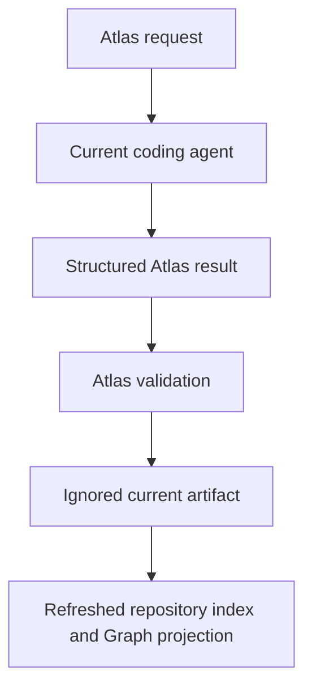

# Atlas Generation Providers

Status: active

Atlas generation turns bounded repository sources into validated, source-cited
candidate artifacts in ignored Atlas Instance state. Retrieval remains
separate and continues to read knowledge already owned by the repository.

`TAXONOMY.md` owns the canonical names. This document owns the executable
handshake, adapter boundary, artifact schemas, and validation rules.
`EVIDENCE_SOURCES_AND_MAPPING.md` explains how admitted sources become
retrieval evidence and how `atlas map` selects its cited orientation packet.

## Default: Current Agent

Every new Atlas Instance starts with:

```json
{
  "generation": {
    "mode": "current-agent",
    "providerId": "current-agent",
    "adapterCommand": "",
    "dataBoundary": "interactive"
  }
}
```

This does not mean Atlas can discover or call the user's open Codex, Claude,
or other agent session. `current-agent` is an interactive handshake:



Create a request from sources admitted by the instance policy:

```bash
.atlas/bin/atlas generation request \
  --kind source-summary \
  --source docs/ARCHITECTURE.md
```

The command stores the request under `.atlas/state/generation/requests/` and
prints its exact JSON. The current agent returns the Generation Result v1
artifact with `provider.mode` set to
`current-agent`, its actual agent identity in `provider.id`, the unchanged
request digest, and exact source paths and digests. Apply the result from a
repository-local file:

```bash
.atlas/bin/atlas generation apply \
  --artifact .atlas/state/generation/candidate.json
```

Apply rejects stale sources, altered request identity, mismatched provenance,
unsupported task kinds, and malformed artifacts. It writes ignored generated
state and rebuilds the repository index. It does not rewrite `memory/`,
`docs/`, or another durable source root.

Repository mapping uses the same handshake through one higher-level command:

```bash
.atlas/bin/atlas map
```

In `current-agent` mode the command stores the exact bounded request and prints
its repository-relative path, digest, orientation summary, and the existing
`generation apply` command that accepts the agent's result. In `command` mode
Atlas invokes the configured adapter, validates and applies the result, and
rebuilds the index. Remote command adapters still require `--allow-remote`;
mapping does not create a second provider authority.

## Command Adapters

A local executable can implement the same request/result contract. Configure
one explicitly:

```bash
.atlas/bin/atlas generation configure command \
  --id atlas-mock \
  --command .atlas/runtime/atlas/scripts/atlas-generation-mock \
  --data-boundary local
```

Atlas starts the command directly without a shell, writes the request JSON to
stdin, reads one result JSON object from stdout, validates it, applies it, and
refreshes the index:

```bash
.atlas/bin/atlas generation run \
  --kind room-specification \
  --source docs/ARCHITECTURE.md
```

The same adapter executes repository mapping with:

```bash
.atlas/bin/atlas map [--allow-remote]
```

The adapter command is consumer-relative and stored in
`.atlas/atlas.instance.json`. Credentials and secret values never belong in
that file or the Atlas installation lock.

## Remote Processing Grant

A command adapter that transmits source content must be configured with
`dataBoundary: remote`. Atlas then refuses every invocation unless that exact
command includes `--allow-remote`:

```bash
.atlas/bin/atlas generation run \
  --kind source-summary \
  --source docs/ARCHITECTURE.md \
  --allow-remote
```

The grant applies to one process invocation. It is not persisted. Atlas passes
a short-lived approval environment value to the adapter, but the adapter owns
its provider-specific authentication and privacy controls.

## OpenAI Adapter

The installed `atlas-generation-openai` adapter is the first hosted-provider
implementation. It uses the OpenAI Responses API with `store: false`, requests
a strict JSON result, reads `OPENAI_API_KEY` only from the environment, and
selects its model from `ATLAS_OPENAI_MODEL`, then `OPENAI_MODEL`. It has no
embedded model fallback: hosted model availability and capability change more
quickly than Atlas releases, so every remote invocation must cross a deliberate
consumer-owned model boundary.

Configure it per Atlas Instance:

```bash
.atlas/bin/atlas generation configure command \
  --id openai \
  --command .atlas/runtime/atlas/scripts/atlas-generation-openai \
  --data-boundary remote
```

Before the invocation, select the exact model allowed for that environment:

```bash
export ATLAS_OPENAI_MODEL="<supported-model-id>"
```

Consult the provider's current model documentation when choosing that value;
Atlas records the adapter-returned model identity in the generated artifact.

A live call sends the selected source content to OpenAI. Tests therefore use a
synthetic repository fixture and require both the API key and the explicit
per-invocation remote grant. Private consumer material is never the default
integration fixture.

## Artifact Tasks

The v1 contract admits five task kinds:

| Task | Result use |
| --- | --- |
| `source-summary` | Replaces the generated summary for exactly one source-evidence record while its source digest remains current. |
| `workspace-entry-summary` | Supplies the generated summary for the repository authority room. |
| `room-specification` | Adds a generated source-backed room with a stable id, label, viewpoint, facets, and answerable questions. |
| `route-explanation` | Stores a source-backed current explanation artifact for consumer route workflows. |
| `repository-system-model` | Maps repository purpose, responsibility-level semantic rooms, directed relationships/flows, confidence, and unknowns from a bounded orientation packet. |

## Repository System Model v1

The Repository System Model v1 schema defines a strict generated artifact, not
durable repository authority. It contains:

- repository `purpose`, `nonGoals`, evidence citations, and confidence;
- semantic `components` with responsibility, viewpoint, optional conceptual
  region, facets, answerable questions, citations, and confidence;
- directed `relationships` whose endpoints must name declared components;
- directed multi-step `flows` over declared components; and
- explicit source-cited `unknowns`.

Every citation is an exact `{ path, digest }` pair from the request. The request
contains no more than twenty-four selected source bodies and binds a
`sha256-path-digest-v1` identity over the complete admitted source inventory.
Apply and current-artifact loading compare that identity, so an unselected
source change quarantines the model instead of leaving it marked current. The
selection and freshness flow is documented in
`EVIDENCE_SOURCES_AND_MAPPING.md`.

The request digest records input provenance; it is not the mapped Repository
System Model's identity. Atlas derives separate canonical digests for the
validated result and its system model. Accepted history uses both request and
result digests in its filename so two valid judgments over the same inputs
cannot overwrite each other, while the current slot records the explicitly
last-applied local choice.

The validator rejects unexpected fields, uncited claims, changed digests,
duplicate ids, bad or self-referential endpoints, invalid flow steps, and
single-file components whose label or id merely repeats the evidence filename.
Only a fresh accepted system model can create default-adapter semantic Graph
rooms. `source-summary` and `room-specification` artifacts remain retrieval
evidence; they do not independently grant Graph navigation.

Current generated artifacts are rebuildable instance state. Consumers that
want a generated decision or specification to become durable knowledge must
review and promote it through their own repository workflow.

## Supported Adapter Boundary

Atlas currently commits to the current-agent handshake, generic command
protocol, deterministic mock, and the OpenAI command adapter. The opt-in live
synthetic fixture passes through the hosted Responses API, explicit remote
grant, strict result validation, generated-index consumption, and credential
non-persistence checks. Another hosted or local transport is supported only
after it has an executable adapter contract and provider-specific integration
test; protocol compatibility alone is not a support claim.
