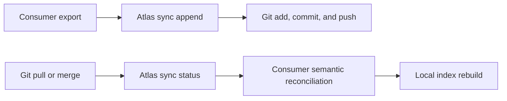

# Atlas Sync And Reconciliation Contract

Atlas sync is consumer scoped. A repository decides which durable records are
eligible for exchange and which private Git remote, if any, carries them.
Atlas supplies stable identities, immutable revision objects, causal merge
rules, and explicit conflicts. It does not own Git credentials or invoke Git.

## Identity And Provenance

A stable record id is the SHA-256 identity of:

- `repositoryId` — a stable consumer repository slug;
- `namespace` — the consumer-defined record class;
- `logicalKey` — the stable logical record key, commonly a repository-relative
  durable memory path or a repository-owned semantic key.

The same logical record therefore has the same id on every machine. Content is
not part of record identity.

Every revision carries a configured opaque `machineId` and a repository-wide
monotonic `sequence`. Atlas never derives the machine id from hostname,
username, hardware, or checkout path. `authoredAt` is optional evidence and is
never used to choose a merge winner.

## Immutable Git Transport

The installed `atlas sync append` command writes one canonical JSON revision
at:

```text
atlas-sync/v1/repositories/<repository-id>/records/<record-id>/<revision-id>.json
```

Revision ids are hashes of canonical revision content. Existing files may be
re-appended only with identical content. The exchange layout has no mutable
head or manifest file, so two machines normally add different paths and let
Git perform ordinary file integration.

The consumer owns the surrounding workflow:



The Atlas command never runs the Git steps. This keeps account choice, remote
layout, authorization, and private-data policy outside the reusable product.

## Deterministic Reconciliation

Reconciliation reduces causal heads for each stable record:

1. A single head resolves to that revision.
2. A descendant supersedes its ancestors regardless of input order.
3. Concurrent heads with identical operations and values are reported as
   semantic duplicates and resolve to a deterministic canonical head.
4. Concurrent different values remain `divergent-active-claims`.
5. Concurrent delete and update heads remain `delete-update`.
6. Missing parents, cross-record parents, causal cycles, and reused
   machine/sequence slots remain explicit integrity conflicts.

No timestamp, machine id, lexical order, or last writer silently wins a
divergent conflict. Resolution is a new revision whose `parents` list contains
every conflicting head and whose value records the consumer's reviewed result.
After that merge revision is exchanged, the record again has one causal head.

Reconciliation output is pure data. It does not rewrite repository memory,
delete revision objects, rebuild indexes, or promote observations into durable
claims. Consumer semantic reconciliation runs after this transport-level gate.

## Installed CLI

Run sync commands from the repository that owns the Atlas Instance. The
installed command reads the repository ID, namespace, and exchange path from
`.atlas/atlas.instance.json`:

Inspect the product contract:

```bash
cd /path/to/your-repository
.atlas/bin/atlas sync contract
```

Derive a stable record id:

```bash
.atlas/bin/atlas sync id \
  --logical-key docs/decisions/example.md
```

Append an upsert revision from a JSON payload:

```bash
.atlas/bin/atlas sync append \
  --logical-key docs/decisions/example.md \
  --machine-id configured-machine-a \
  --sequence 1 \
  --payload-file sync-payload.json
```

Inspect all revision objects for the instance repository:

```bash
.atlas/bin/atlas sync status
```

`sync status` performs deterministic reconciliation without writing source
files. It exits `0` when clear and `2` when explicit conflicts are present.

The default exchange path belongs to the instance. To use a separately managed
private exchange checkout without changing the tracked instance file, set the
explicit override for each command:

```bash
ATLAS_SYNC_EXCHANGE_ROOT=/path/to/private-exchange \
  .atlas/bin/atlas sync status
```

Atlas still does not run Git. The repository owner decides when and where to
add, commit, pull, merge, and push the immutable exchange files.
