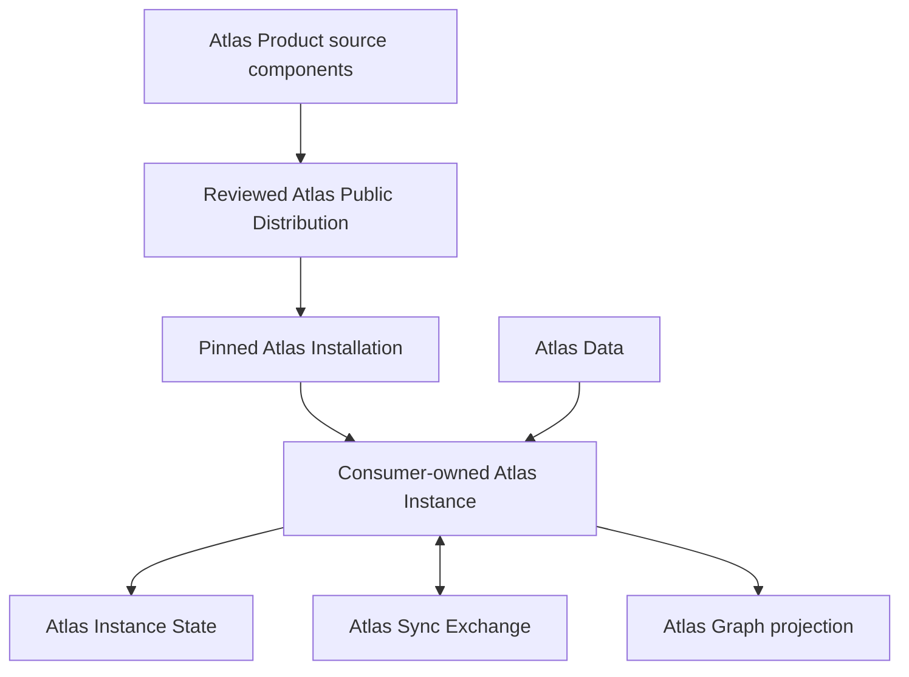

# Atlas Product Taxonomy

Status: active

This document owns stable Atlas names and ownership boundaries. Runtime
behavior belongs to the corresponding contract documents, not to this
taxonomy.

## Canonical Terms

| Term | Meaning | Owner or location |
| --- | --- | --- |
| **Atlas Product** | The complete source-neutral, distributable repository evidence system. It includes Atlas Core and the optional Atlas Graph lens. | Product source components and reviewed distributions. |
| **Atlas Core** | The reusable retrieval, evidence, generation, installation, instance, sync, CLI, and Graph-launch component. `Core` names the component, not an installed solution. | `core/product/` and distributable `core/scripts/atlas*`. |
| **Atlas Graph** | The optional visual lens over an Atlas Instance's provider projections and cited system model. It does not own repository knowledge. | `graph/` in the public distribution. |
| **Atlas Product source components** | The reviewed Core and Graph source trees from which a distribution is assembled. | Atlas Core and Atlas Graph component sources. |
| **Atlas Public Distribution** | A clean-history public repository assembled deterministically from reviewed Product source revisions. It is a release surface until source authority is deliberately migrated. | The public distribution repository. |
| **Atlas Installation** | Exact, pinned Core and optional Graph product files copied into a consumer-selected root. | Normally `<consumer>/.atlas/runtime`, verified by the install manifest and lock. |
| **Atlas Uninstallation** | Deterministic removal of one Installation and its marker-owned repository integrations, without removing consumer data or external sync authority. | The installed command or matching distribution recovery command. |
| **Atlas Instance** | One configured Atlas solution belonging to a repository, meta-repository, or explicit machine-global scope. It combines an Installation with consumer-owned binding, data, generated state, and sync policy. | The consumer-selected root. |
| **Atlas Instance Binding** | Repository identity, bounded source policy, optional adapter, provider configuration, Graph entry, index path, and sync namespace. | `<consumer>/.atlas/atlas.instance.json` plus consumer-owned adapter/provider files. |
| **Atlas Data** | Durable repository knowledge: documentation, decisions, source material, catalogs, and reviewed sync records. | Consumer-owned admitted source paths outside `.atlas/`. |
| **Atlas Instance State** | Rebuildable indexes, caches, logs, generated artifacts, and projections. | Consumer-local ignored `.atlas/` paths. |
| **Atlas Sync Exchange** | Immutable causal revision objects transported under consumer-selected Git/remotes and reconciled by Atlas. | The consumer repository or an explicit exchange repository. |
| **Repository Provider** | The retrieval-side authority that exposes a consumer-owned catalog, local index, ranked results, and Graph projections. | Core supplies the contract; the Instance owns its catalog, adapter, index, and optional Graph provider. |
| **Generation Provider** | The optional writing-side capability that produces validated, source-cited candidate artifacts. | Core owns the request/result contract; the Instance selects the execution mode and adapter. |
| **Current Agent** | The interactive coding agent already working with the user and able to complete an Atlas generation handshake. | The active agent host plus the consumer-owned Instance handshake. |

## Retrieval And Generation

The Repository Provider indexes and retrieves knowledge already owned by the
repository. The Generation Provider creates candidate derived artifacts from
explicitly bounded sources. They are separate authorities; neither makes a
generated artifact durable repository truth.

[`GENERATION_PROVIDERS.md`](GENERATION_PROVIDERS.md) defines current-agent,
command, remote-processing, and provider-specific behavior. The file-to-index
and source-to-map flow is explained in
[`EVIDENCE_SOURCES_AND_MAPPING.md`](EVIDENCE_SOURCES_AND_MAPPING.md).

## Physical Instance Boundary

The consumer-selected root is the Atlas Instance root. Its `.atlas/` directory
is the control plane: it holds manifests, locks, installed commands/runtime,
and ignored local state. Durable consumer knowledge remains in admitted paths
outside `.atlas/`, such as `docs/`, `memory/`, or `src/`.

This boundary keeps knowledge readable through Git, editors, and agents when
Atlas is unavailable. It also prevents the instance control plane from
indexing itself. Uninstallation follows the same boundary in reverse: Atlas
may remove its runtime, state, and marker-owned integration bytes, but not the
repository's admitted source files.

Do not move durable knowledge under `.atlas/` merely to make the Instance look
like one directory. The Instance is an ownership aggregate rooted at the
consumer, not a product payload directory.

## Ownership Sentence

Use this form when describing a consumer:

> The repository's Atlas Instance uses a pinned Atlas Product installation and
> owns its knowledge, adapter, provider configuration, indexes, Graph binding,
> and sync exchange.

Atlas Product does not own project, organization, or user memory. Core supplies
contracts and commands; an Instance applies them under consumer authority.

## Product And Instance Flow

Product updates move reusable code into an Installation. They do not move,
merge, or rewrite Atlas Data. Sync moves consumer-owned causal records; it does
not update Product code.

## Stable Names

The `atlas` command and published wire-schema identifiers are compatibility
boundaries. Historical schema text does not change current ownership.

Architecture traversal uses these role names:

- `Atlas Product` for the complete product boundary;
- `Atlas Core` for the reusable runtime component;
- `Atlas Graph` for the optional visual lens;
- `<Repository Name> Atlas Instance` for a repository-owned solution; and
- `RAG Provider Runtime`, `RAG Retrieval Index`, and `RAG Source Derivation`
  for Instance-owned drilldowns.

A machine-global installation is a `Machine Atlas Instance`; it is not a
global memory authority for repository-local instances. Version identities and
the conditions for changing their boundaries belong to
[`VERSIONING.md`](VERSIONING.md).
