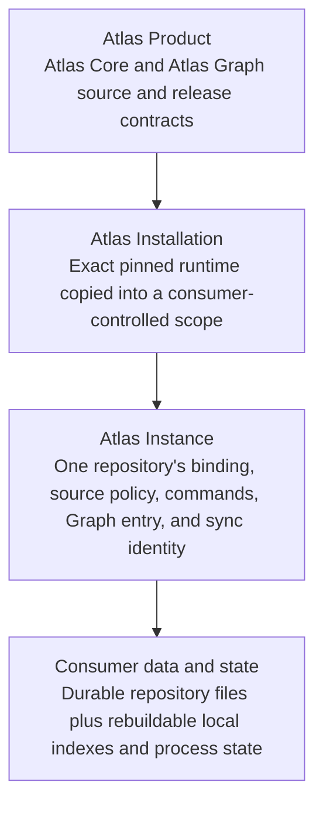
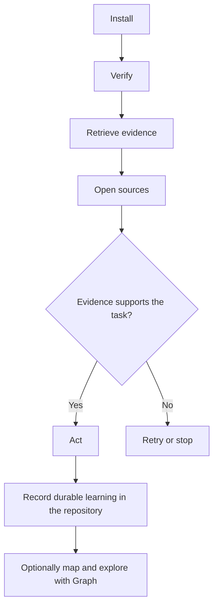
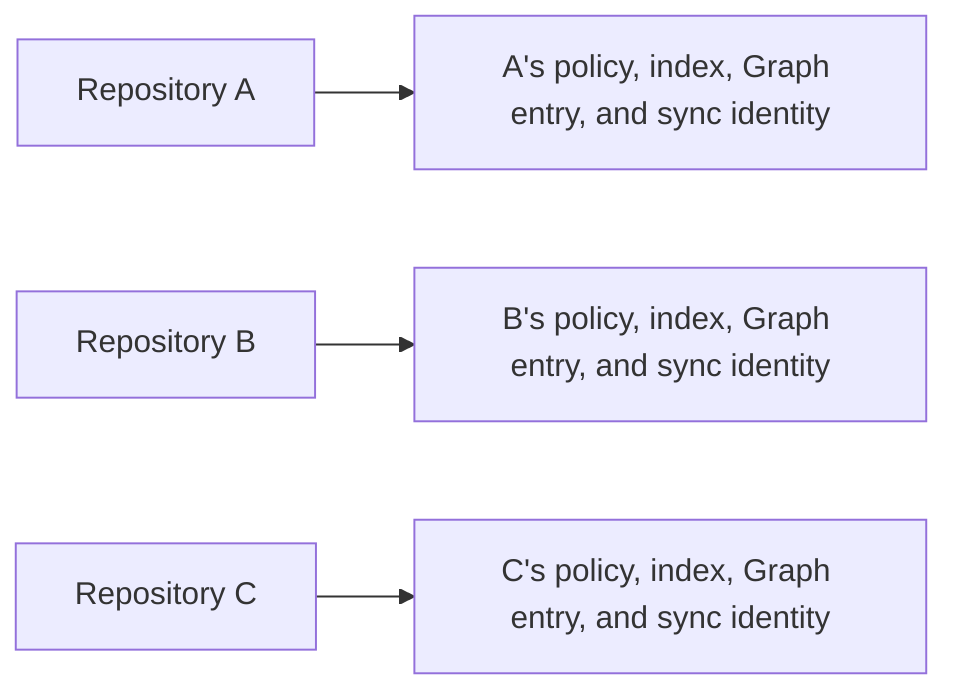
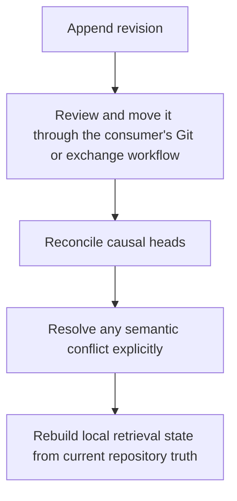
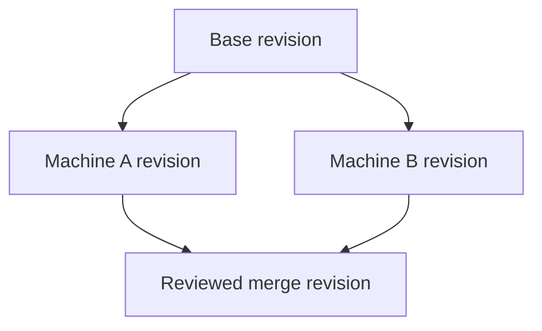

# Atlas Product Walkthrough

Status: active product handbook
Owner: Atlas Core

## Purpose

This walkthrough explains Atlas in the order a person normally encounters it.
It is the plain-English handbook for understanding what Atlas is, where it
lives, how an agent uses it, and how the same ownership model holds across
repositories and machines.

The short version is:

```text
Atlas helps an agent find the right repository knowledge before acting.
The repository keeps the knowledge. Atlas keeps the local retrieval machinery.
```

This file builds the mental model. Exact schemas and invariants remain in the
linked product contracts.

## Atlas In Plain English

Think of Atlas as a repository librarian.

The librarian does not own the books. The repository owns its decisions,
architecture notes, operating instructions, source code, and other durable
files. Atlas catalogs the files that the repository permits it to read,
retrieves evidence for a task, and gives the agent relative paths and bounded
passages to verify in the originals.

Atlas can also build a cited system map. Atlas Graph renders that map as rooms
and relationships. The map helps a person explore the project, but the cited
repository files remain authoritative.

## What Atlas Is

Atlas is:

- an installable repository-local evidence system;
- a rebuildable local index over explicitly admitted repository files;
- an Evidence v2 handoff from retrieval to source verification;
- an optional cited project map and visual Graph;
- a causal exchange and reconciliation protocol for multi-machine work; and
- a pinned dependency that each repository updates deliberately.

Atlas is not:

- a central warehouse for every repository's memory;
- a hidden durable-memory directory under `.atlas/`;
- a substitute for opening the cited source;
- an agent that decides or writes the final answer by itself;
- a last-writer-wins sync service;
- a Git client, publisher, or credential manager; or
- one mutable global index shared by every repository.

## The Mental Model

Four layers keep product code, installed code, repository knowledge, and local
state from becoming entangled:



The Product is developed and released independently. An Installation is a
verified copy of selected Product components. An Instance is one repository's
configured use of that installation. The repository owns its durable knowledge
throughout.

| Name | Meaning | Owner |
| --- | --- | --- |
| Atlas Product | The complete reusable solution | Atlas product development |
| Atlas Core | Retrieval, evidence, installation, instance, sync, and command runtime | Atlas Product |
| Atlas Graph | The optional visual lens | Atlas Product |
| Atlas Installation | Pinned runtime files copied into a chosen scope | Installing consumer |
| Atlas Instance | One repository's configured use of Atlas | Consumer repository |
| Atlas Data | Durable files admitted by that repository | Consumer repository |
| Atlas Instance State | Indexes, caches, and running processes | Local machine, rebuildable |
| Atlas Sync Exchange | Immutable causal revisions | Consumer repository |

[`TAXONOMY.md`](TAXONOMY.md) defines the complete vocabulary.

## Where An Instance Lives

The normal repository-local installation keeps its control plane under one
root:

```text
consumer-repository/
  docs/, memory/, src/          durable repository-owned knowledge
  .atlas/
    atlas.instance.json         tracked source policy and consumer binding
    atlas.install.json          tracked component provenance
    atlas.lock.json             tracked installed-file digests
    bin/                        ignored relative command shim
    runtime/                    ignored pinned runtime
    state/                      ignored rebuildable index and local state
```

The durable folders can have any names admitted by the instance policy. The
important rule is that deleting a local Atlas index costs time, not knowledge.
[`INSTANCE.md`](INSTANCE.md) defines the repository-local ownership boundary.

## The Golden Path

A normal Atlas journey is small:



### 1. Install And Verify

Install from the downloaded Atlas distribution:

```bash
cd /path/to/atlas
scripts/atlas-init \
  --repo /path/to/consumer \
  --include README.md \
  --include docs \
  --include src \
  --extension .js \
  --with-graph
```

Then work from the consumer repository:

```bash
cd /path/to/consumer
.atlas/bin/atlas verify
```

The instance source policy decides what Atlas may read. Product updates cannot
silently broaden it. [`INSTALLATION.md`](INSTALLATION.md) explains bootstrap,
verification, tracked control files, and explicit updates.

### 2. Retrieve Before Broad Exploration

The agent begins with the repository-local command:

```bash
.atlas/bin/atlas evidence "the user's request"
```

Atlas returns ranked source pointers, bounded excerpts, freshness, match
reasons, and one of five states:

| State | Agent response |
| --- | --- |
| `strong` | Open and verify the cited source, then continue |
| `weak` | Narrow the query or inspect more sources |
| `stale` | Refresh the derivation and verify current files |
| `missing` | Find or request the missing durable context; do not invent it |
| `conflicting` | Stop the affected conclusion and reconcile the conflict |

The packet is navigation evidence, not permission to act without reading the
file. [`EVIDENCE_SOURCES_AND_MAPPING.md`](EVIDENCE_SOURCES_AND_MAPPING.md)
shows how repository files become indexed evidence, how freshness is checked,
and why uncited summaries remain weak. [`EVIDENCE_V2.md`](EVIDENCE_V2.md) owns
the exact packet and state rules.
[`AGENT_RAG_WORKFLOW.md`](AGENT_RAG_WORKFLOW.md) defines the agent's obligations.

### 3. Open The Sources And Do The Work

The agent opens the relevant relative paths, reads enough surrounding context,
checks current implementation and repository state, and only then answers,
plans, or edits. Scores and summaries narrow attention; they do not outrank the
repository's authority rules.

If the task creates a durable decision, invariant, or operating rule, it goes
back through the repository's normal documentation or memory workflow. Atlas
refreshes its disposable index from those files; the agent does not write
knowledge directly into SQLite or generated Graph state.

### 4. Map The Project When A Visual Model Helps

Evidence works without a system map. To build or refresh the separately cited
model used by Graph:

```bash
.atlas/bin/atlas map
```

With the default current-agent binding, Atlas writes a bounded request for the
active coding agent. The command returns `action-required` and prints both the
request path and the command that applies the agent's JSON result. A configured
command adapter completes the same exchange in one invocation.

```bash
.atlas/bin/atlas graph --open
```

Before mapping, Graph may show a truthful Source Inventory. After Atlas accepts
a current cited model, Graph can show responsibilities, components,
relationships, flows, and unknowns. Mapping sources and rationale are explained
in [`EVIDENCE_SOURCES_AND_MAPPING.md`](EVIDENCE_SOURCES_AND_MAPPING.md), while
the exact provider handshake and validation rules belong to
[`GENERATION_PROVIDERS.md`](GENERATION_PROVIDERS.md).
[`INSTANCE.md`](INSTANCE.md) defines the resulting room semantics.

## Many Repositories On One Machine

Three repositories normally have three independent instances:



They may pin the same Atlas Product releases, but they do not share durable
knowledge, mutable indexes, generated state, or sync history. One repository
can update Atlas without silently changing its neighbors. A machine-global
installation is an explicit alternative scope, not a reason to merge instance
data.

## One Repository On Many Machines

The same repository can have local Atlas copies on several machines. Tracked
repository files and instance contracts move through the repository's chosen
workflow. Ignored indexes and process state remain local and rebuildable.

Different machines may do different work. Atlas does not choose the newest
timestamp when concurrent claims disagree. Atlas Sync records immutable
revisions with stable repository-scoped identities and causal parents. Atlas
never invokes Git; the consumer decides how exchange files move.



## Reconciliation In Plain English

Suppose two machines begin from the same revision:



Equivalent claims can be recognized deterministically. Different claims about
the same logical record remain two visible heads. Neither clock time nor
machine order makes one authoritative. A reviewed merge names both heads as
parents.

That decision remains inspectable and causal. [`SYNC.md`](SYNC.md) defines
record identity, revisions, exchange paths, reconciliation, and conflicts.

## Privacy And Failure Philosophy

Atlas is local-first, but locality does not grant permission. The repository's
source policy still decides which files Atlas may read. Evidence returns
relative admitted paths, Graph renders only provider projections, and sync or
publication happens only through consumer-selected workflows.

Atlas fails at the narrowest boundary it can still explain:

| Situation | Safe behavior |
| --- | --- |
| Installed bytes differ from the lock | Reject verification |
| Index is absent or old | Rebuild it from admitted repository files |
| Source is excluded | Do not read it or reveal its path |
| Evidence is weak, stale, or missing | Report uncertainty instead of upgrading it |
| Evidence conflicts | Stop the affected conclusion |
| Causal heads disagree | Keep both until a reviewed merge exists |
| Checkout moves | Continue through relative commands and locators |
| Product source advances | Keep the instance pinned until explicit update |
| Graph cannot start | Keep Evidence and durable repository files usable |
| Source inventory exceeds the supported Graph scale | Continue through Evidence or narrow the source policy |
| Uninstall finds sync history or unknown content | Stop before deleting it |

[`KNOWN_LIMITATIONS.md`](KNOWN_LIMITATIONS.md) records current scale limits.
[`EVIDENCE_V2.md`](EVIDENCE_V2.md) defines Evidence failure states. The
consumer remains responsible for what enters the repository, crosses machines,
or becomes public.

## Lifecycle And Release Signposts

Atlas treats update and removal as explicit lifecycle operations. A newer
distribution updates a repository through `scripts/atlas-init --update`;
`.atlas/bin/atlas uninstall --dry-run` previews removal before the actual
uninstall. Both preserve consumer-owned durable files. See
[`INSTALLATION.md`](INSTALLATION.md) and
[`UNINSTALLATION.md`](UNINSTALLATION.md).

Core, Graph, Evidence compatibility, installations, and the public distribution
have distinct version boundaries. [`VERSIONING.md`](VERSIONING.md) explains
them. The public tree is a deterministic reviewed export rather than a second
implementation authority. Its root component manifest records the exact
reviewed inputs; the source-only export workflow is deliberately not copied
into the distribution. Current release changes belong in `CHANGELOG.md` and
the component manifest rather than this handbook.

## Continue Reading

For a first review:

1. Read [`TAXONOMY.md`](TAXONOMY.md) for exact names and ownership.
2. Read [`EVIDENCE_SOURCES_AND_MAPPING.md`](EVIDENCE_SOURCES_AND_MAPPING.md)
   for the complete evidence and mapping mechanics.
3. Read [`AGENT_RAG_WORKFLOW.md`](AGENT_RAG_WORKFLOW.md) for the normative
   evidence-before-action loop.
4. Read [`ARCHITECTURE.md`](ARCHITECTURE.md) for Product and Graph boundaries.
5. Read [`SYNC.md`](SYNC.md) for multi-machine reconciliation.
6. Read [`RESEARCH_FOUNDATIONS.md`](RESEARCH_FOUNDATIONS.md) for independent
   origin, later influences, and non-claims.

The central rule does not change across any of those documents: each consumer
repository owns its durable knowledge and receives an independent Atlas
instance over that knowledge.
